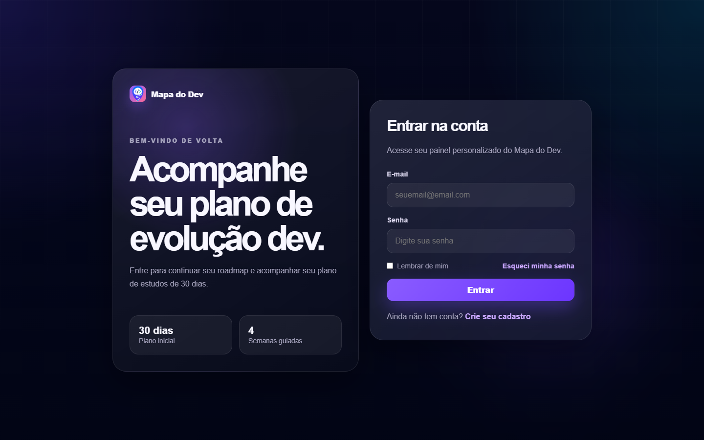
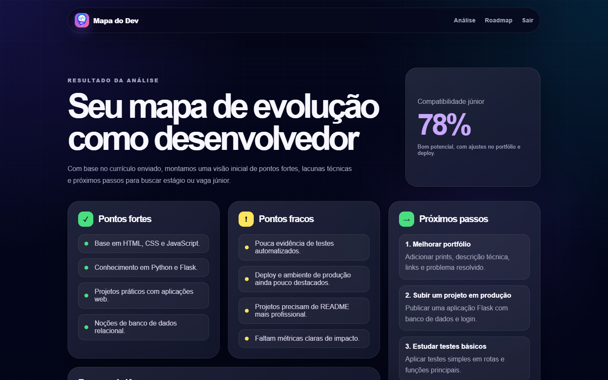

# Mapa do Dev

Mapa do Dev e uma plataforma em desenvolvimento para analisar curriculos de profissionais de tecnologia e transformar essas informacoes em um plano de evolucao personalizado.

A proposta do projeto e ajudar estudantes, pessoas em transicao de carreira e desenvolvedores junior a entenderem melhor seus pontos fortes, lacunas tecnicas e proximos passos para chegar mais perto de uma vaga.

## Status do projeto

MVP em desenvolvimento.

O projeto ja possui a base visual e estrutural da aplicacao, incluindo paginas de apresentacao, login, cadastro e dashboard demonstrativo. A analise real com IA e o processamento completo de curriculos ainda fazem parte do planejamento.

## O que ja esta pronto

- Landing page apresentando a proposta do Mapa do Dev.
- Tela de login.
- Tela de cadastro.
- Dashboard demonstrativo com:
  - compatibilidade com vaga junior;
  - pontos fortes;
  - pontos fracos;
  - proximos passos;
  - resumo da analise;
  - roadmap de estudos de 30 dias.
- Estrutura Flask organizada com Blueprints.
- Modelo inicial de usuario com SQLAlchemy.
- Configuracao de banco PostgreSQL via variaveis de ambiente.
- Arquivos CSS separados por responsabilidade.
- Scripts JavaScript iniciais para interacoes de formulario e simulacao de upload.

## Prints das paginas

### Home


### Login



### Cadastro


### Dashboard



## O que esta planejado

- Upload real de curriculo em PDF.
- Leitura e extracao de texto do curriculo.
- Integracao com IA para gerar analises personalizadas.
- Cadastro de usuarios salvando dados no banco.
- Login com autenticacao real e sessoes.
- Historico de curriculos analisados.
- Dashboard dinamico baseado no perfil do usuario.
- Roadmaps personalizados por area, como frontend, backend, dados ou mobile.
- Sugestao de estudos, projetos praticos e proximas tecnologias.
- Exportacao do plano em PDF.
- Melhorias de seguranca, validacao e tratamento de erros.
- Testes automatizados para rotas, modelos e fluxos principais.

## Tecnologias usadas

- Python
- Flask
- Flask-SQLAlchemy
- PostgreSQL
- psycopg
- python-dotenv
- HTML
- CSS
- JavaScript

## Estrutura do projeto

```text
mapa-do-dev/
|-- main.py
|-- models/
|   |-- database.py
|   `-- usuario.py
|-- routes/
|   |-- auth.py
|   `-- dashboard.py
|-- static/
|   |-- css/
|   |-- img/
|   `-- js/
|-- templates/
|   |-- dashboard.html
|   |-- index.html
|   |-- login.html
|   `-- register.html
`-- README.md
```

## Como rodar localmente

1. Clone o repositorio:

```bash
git clone https://github.com/seu-usuario/mapa-do-dev.git
cd mapa-do-dev
```

2. Crie e ative um ambiente virtual:

```bash
python -m venv venv
```

No Windows:

```bash
venv\Scripts\activate
```

No Linux/macOS:

```bash
source venv/bin/activate
```

3. Instale as dependencias principais:

```bash
pip install Flask Flask-SQLAlchemy psycopg python-dotenv
```

4. Crie um arquivo `.env` na raiz do projeto com as configuracoes do banco:

```env
user=seu_usuario
senha=sua_senha
host=localhost
nome_do_banco=mapa_do_dev
```

5. Execute a aplicacao:

```bash
python main.py
```

6. Acesse no navegador:

```text
http://localhost:5000
```

## Observacoes

Este projeto ainda esta em fase inicial. Algumas telas ja representam a experiencia planejada, mas parte dos dados exibidos no dashboard ainda e demonstrativa.

O objetivo final e que o usuario envie um curriculo, receba uma analise personalizada por IA e consiga acompanhar um plano pratico de evolucao profissional.
